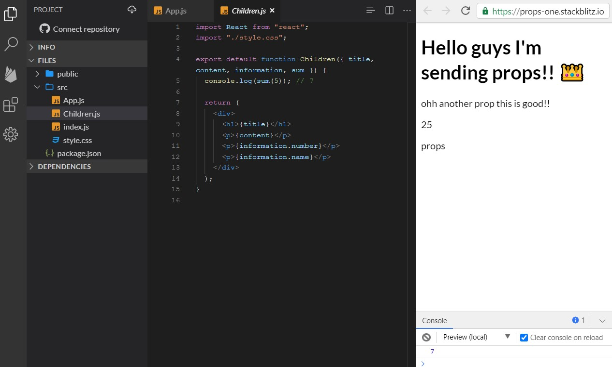
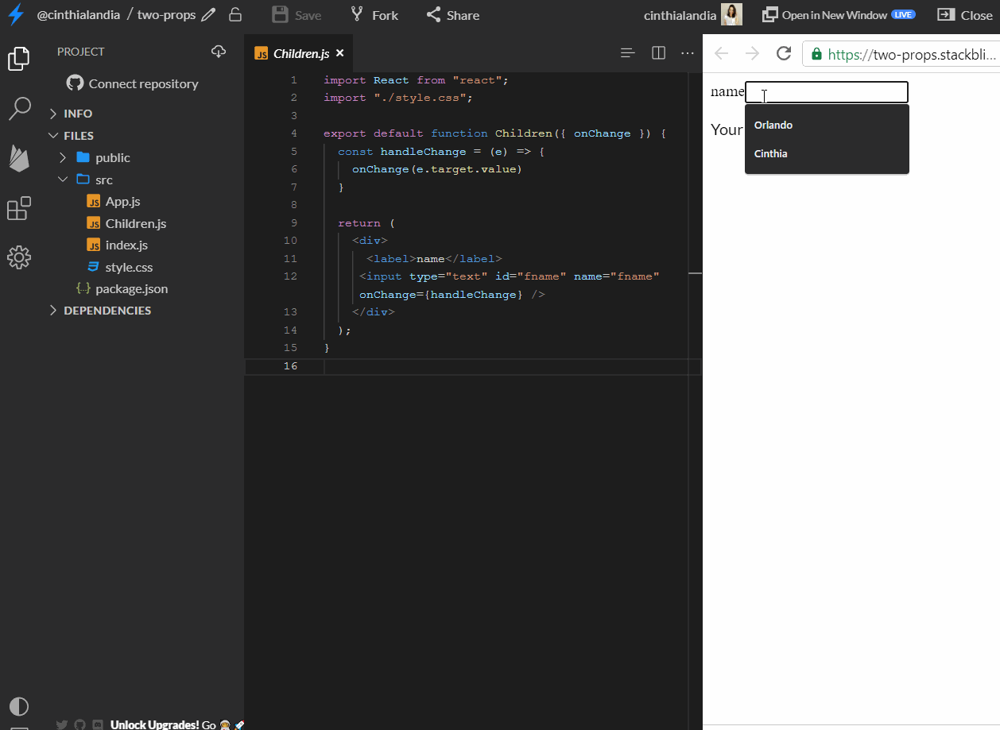
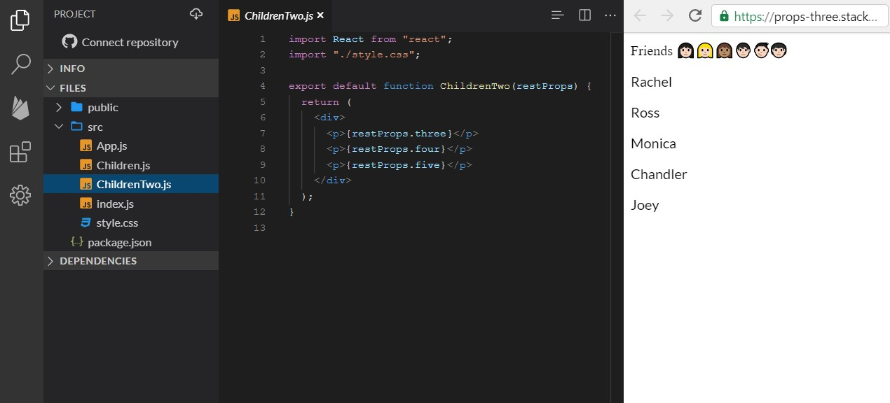
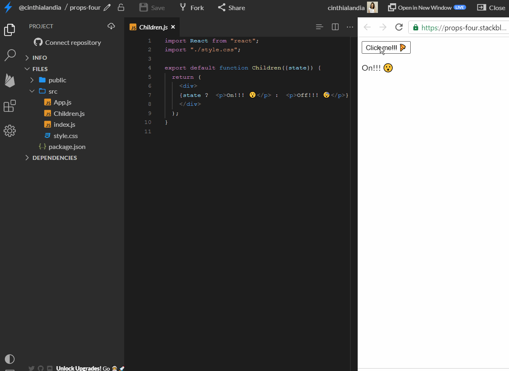
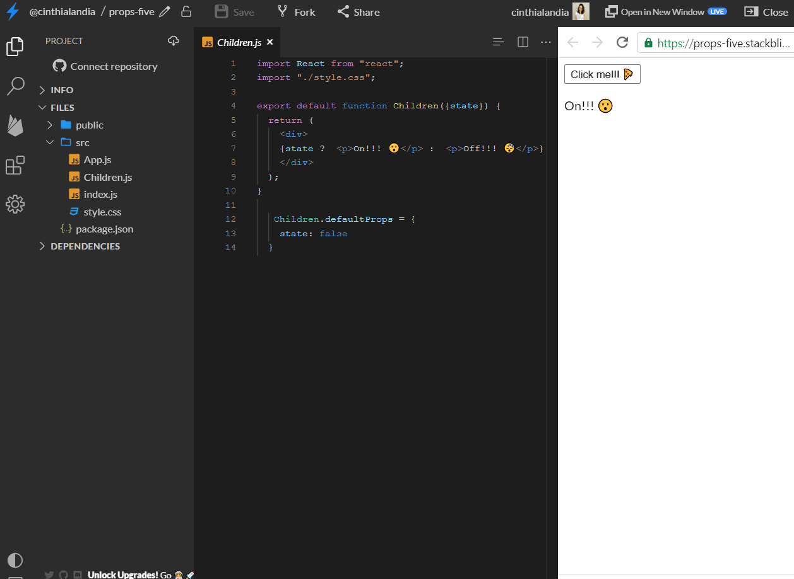
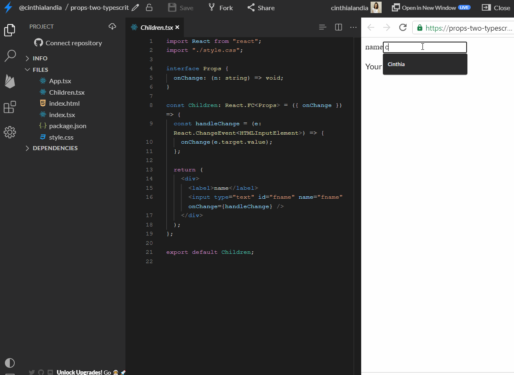
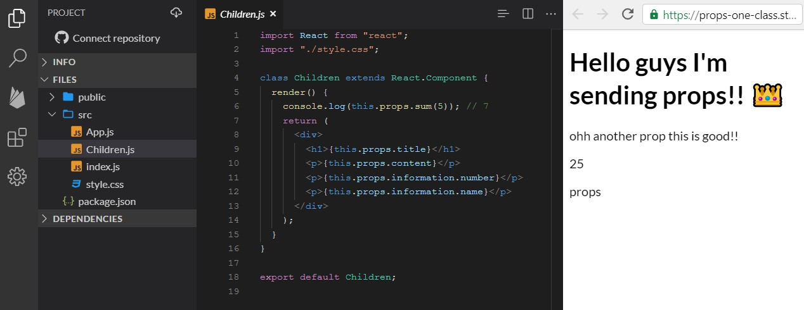
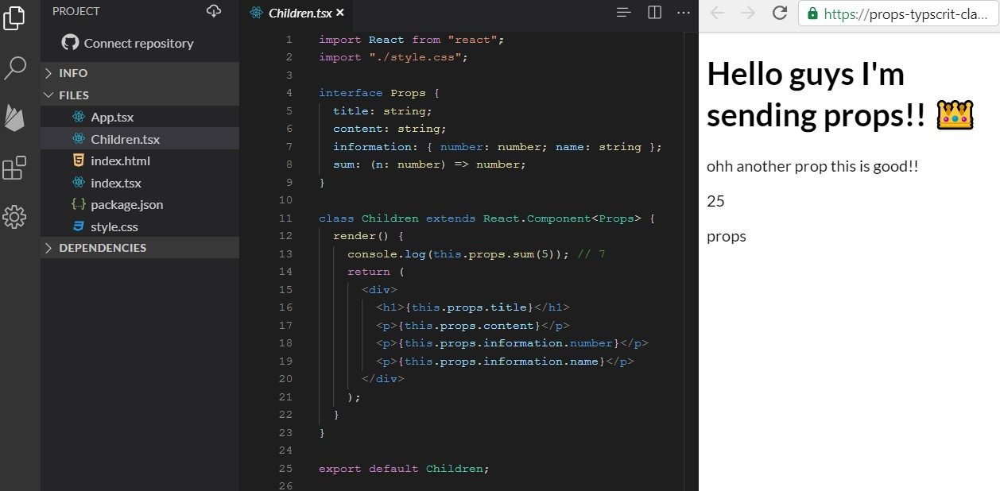

## Pero primero ¿Que son los props?

Son un patrón para compartir información entre un componente padre y un componente hijo, donde el componente padre setea atributos y los envía al componente hijo como un objeto. Es importante saber que esto trabaja de manera unilateral, es decir, que la información solo se comparte desde que el padre hacía el hijo y no al revés.

## ¿Como usar props?

Los props son usados por componentes de React, pero la sintaxis de los mismos varían dependiendo del componente utilizado

Para estos ejemplos utilizaremos componentes funcionales. Al final del blog estarán los mismo ejemplos para componentes de clases.

### Props de padre a hijo

Tenemos el ejemplo de 2 archivos js llamados `App` y `Children` donde el app será nuestro componente padre y el children será nuestro componente hijo. En nuestro componente tenemos declarado un objeto `information`, una función que realiza una suma, y 2 variables con valores de string.

Declaramos nuestro componente hijo `Children` como parte de nuestra renderización del componente y asignamos attributes (cualquier nombre válido para atributos HTML) y lo igualamos a la variable o función que se desee pasar, como observamos más abajo.

```jsx
// App.js
import React from "react"
import Children from "./Children"
import "./style.css"

export default function App() {
  const information = { number: 25, name: "props" }

  const funSum = num => {
    return num + 2
  }
  const title = "Hello guys I'm sending props!! 👑"
  const content = "ohh another prop this is good!!"
  return (
    <>
      <Children
        title={title}
        content={content}
        information={information}
        sum={funSum}
      />
    </>
  )
}
```

El componente funcional Children recibe `props` como el primer parámetro de la función en forma de un objeto, siendo cada property el nombre del atributo seteado por el padre App. Una práctica muy común es deconstruir el objeto recibido.

```js
// Chindren.js
import React from "react"
import "./style.css"

export default function Children({ title, content, information, sum }) {
  console.log(sum(5)) // 7

  return (
    <div>
      <h1>{title}</h1>
      <p>{content}</p>
      <p>{information.number}</p>
      <p>{information.name}</p>
    </div>
  )
}
```

### Dando como resultado



If you want to check the example in real life, click on this link! https://stackblitz.com/edit/props-one?file=src/Children.js

### Props de hijos a padre

Si, como lo lees, anteriormente explique que los props solo funcionan de manera unilateral y que solo podemos enviar información de padre a hijo, pero hay una manera con props para enviar información de hijos a padres y es usando callbacks!!!

Tenemos nuestro ejemplo anterior pero esta vez solo tenemos un input en el cual te pide escribir tu nombre, y mientras que escribes tu nombre va apareciendo escrito debajo del input pero este es renderizado directamente por el componente padre `App`.

En este ejemplo declaramos primeramente un estado donde iremos guardando el nombre que recibiremos de nuestro componente hijo y así poder ser usado por nuestro componente `App`, también tenemos declarado una función donde estamos guardando el nombre recibido y como vemos esta función está siendo enviada como un prop a nuestro componente hijo `Children` bajo el nombre `onChange`. Y por último tenemos la renderización del mensaje con el nombre que será escrito.

```jsx
import React, { useState } from "react"
import Children from "./Children"
import "./style.css"

export default function App() {
  const [name, setName] = useState("")

  const handleNameOnChange = n => {
    setName(n)
  }
  return (
    <>
      <Children onChange={handleNameOnChange} />
      <p> Your name is :{name}</p>
    </>
  )
}
```

Por otra parte tenemos en nuestro componente `Children` que recibe el parámetro la función `onChange` y en nuestra renderización tenemos un input que recibe un event handler. En nuestra función llamada `handleChange` que recibe el evento del nombre ingresado es donde ocurre la magia ya que utiliza la función que viene de props y le asigna como argumento la información del evento, la cual será ejecutada en nuestro componente app.

```jsx
import React from "react"
import "./style.css"

export default function Children({ onChange }) {
  const handleChange = e => {
    onChange(e.target.value)
  }

  return (
    <div>
      <label>name</label>
      <input type="text" id="fname" name="fname" onChange={handleChange} />
    </div>
  )
}
```

### Dando como resultado



Si desea ver el ejemplo en la vida real, haga clic en este enlace!! https://stackblitz.com/edit/two-props?file=src/Children.js

## Props y spread sintaxis

Existen casos donde se necesita pasar los mismos props a niveles más abajo (e.j: el hijo del hijo), por lo que podemos hacer uso de la sintaxis spread, pero hay que tener en cuenta que este solo funciona si lo que se quiere enviar es un objeto o puede unirse en uno.

En este ejemplo tenemos en el componente padre `App` una serie de variables que contienen los nombres de los integrantes de friends, pero estos serán renderizados por su componente hijo directo `Children` y el componente `ChildrenTwo` que es hijo de su hijo (un poco complicado).

```js
import React, { useState } from "react"
import Children from "./Children"
import "./style.css"

export default function App() {
  const nameOne = "Rachel"
  const nameTwo = "Ross"
  const nameThree = "Monica"
  const nameFour = "Chandler"
  const nameFive = "Joey"

  return (
    <>
      <div>Friends 👩🏻👱🏻‍♀️👩🏽🧑🏻👦🏻👨🏻‍🦱</div>
      <Children
        one={nameOne}
        two={nameTwo}
        three={nameThree}
        four={nameFour}
        five={nameFive}
      />
    </>
  )
}
```

Ahora en nuestro componente hijo `Children` recibimos estos props (objeto) y descontruimos el objeto props para guardar en otra variable el resto del objeto que será enviado al componente `ChildrenTwo`. En el objeto children renderizamos los 2 primeros nombres y declaramos el componente hijo `ChildrenTwo` convirtiendo `Children` en su componente padre.

```js
import React from "react"
import ChildrenTwo from "./ChildrenTwo"
import "./style.css"

export default function Children(props) {
  const { one, two, ...restProps } = props

  return (
    <div>
      <p>{props.one}</p>
      <p>{props.two}</p>
      <ChildrenTwo {...restProps} />
    </div>
  )
}
```

En el componente hijo `ChildrenTwo` recibimos el objeto props y renderizamos los nombres faltantes.

### Dando como resultado



Si desea ver el ejemplo en la vida real, haga clic en este enlace!!! https://stackblitz.com/edit/props-three?file=src/ChildrenTwo.js

## Props con valor por defecto

En algunos casos, queremos que los props de un componentes tengan por defecto un valor, el cual será usado si el componente padre no pasa información al componente hijo.

En el siguiente ejemplo tenemos el componente padre `App` el cual renderiza un botón que al ser clickeado mostrará una frase, pero por defecto mostrará otra.

```js
import React, { useState } from "react"
import Children from "./Children"
import "./style.css"

export default function App() {
  const [state, setState] = useState()

  const handleClick = () => {
    setState(true)
  }

  return (
    <>
      <button onClick={handleClick}>Click me!!! 🍕</button>
      <Children state={state} />
    </>
  )
}
```

La renderización de esta frase se encuentra en el componente hijo `Children` la cual al recibir el valor prop `true` imprimirá una frase y si no recibe ningún valor, por defecto será false

```js
import React from "react"
import ChildrenTwo from "./ChildrenTwo"
import "./style.css"

export default function Children({ state = false }) {
  return <div>{state ? <p>On!!! 😮</p> : <p>Off!!! 😴</p>}</div>
}
```

### Dando como resultado


Si desea ver el ejemplo en la vida real, haga clic en este enlace.!!! https://stackblitz.com/edit/props-four?file=src%2FChildren.js

### Otra manera de asignar props por defecto

Es utilizando la sintaxis `defaultProps`. Utilizando el mismo ejemplo anterior, el componente `App` sería declarado de la misma manera, pero al momento de recibir el prop en el componente hijo `Children`, declaramos el nombre del componente seguido de punto y la sintaxis `defaultProps`, seguido del objeto donde asignaremos el valor por defecto de la propiedad.

```js
import React from "react"
import "./style.css"

export default function Children({ state }) {
  return <div>{state ? <p>On!!! 😮</p> : <p>Off!!! 😴</p>}</div>
}

Children.defaultProps = {
  state: false,
}
```

### Dando como resultado



Si desea ver el ejemplo en la vida real, haga clic en este enlace!!! https://stackblitz.com/edit/props-five?file=src/Children.js

## Props y typescript

En Para utilizar props en react con typescript es necesario escribir mas codigo y declarar interfaces, por lo tanto vayamos paso a paso. Debemos aclarar que para esta parte del blog estaremos utilizando los ejemplos anteriores y solo se describe el código extra de typescript.

### Props de padre a hijo

En el componente padre `App` se realiza la declaración de props y no se debe agregar algo extra. Por otra parte el componente hijo `Children` se debe declarar una interface de `Props` donde se declaran todos los props a recibir como propiedades y el tipo de cada uno, como adición a este cambio declaramos en el componente funcional, la sintaxis `React.FC<Props>` lo cual le avisa a typescript que tenemos un componente funcional que recibe `Props`.

```typescript
import React from "react"
import "./style.css"

interface Props {
  title: string
  content: string
  information: { number: number; name: string }
  sum: (n: number) => number
}

const Children: React.FC<Props> = ({ title, content, information, sum }) => {
  console.log(sum(5)) // 7

  return (
    <div>
      <h1>{title}</h1>
      <p>{content}</p>
      <p>{information.number}</p>
      <p>{information.name}</p>
    </div>
  )
}

export default Children
```

### Dando como resultado


Si desea ver el ejemplo en la vida real, haga clic en este enlace!!! https://stackblitz.com/edit/props-one-typscrit?file=Children.tsx

### Props de hijos a padre

Tomando el ejemplo anterior del input, ya que el componente padre `App` es aquel que está enviando los props no se realiza ningún tipo de cambio en el mismo. En el componente hijo `Children` declaramos una interface de props donde asignamos el tipo de la función `onChange` y hacemos el cambio en el componente funcional con la sintaxis esperada por typescript. En este ejemplo no se le realiza un cambio en el componente padre, ya que el mismo recibe la información por medio de el callback que envía como props.

```typescript
import React from "react"
import "./style.css"

interface Props {
  onChange: (n: string) => void
}

const Children: React.FC<Props> = ({ onChange }) => {
  const handleChange = (e: React.ChangeEvent<HTMLInputElement>) => {
    onChange(e.target.value)
  }

  return (
    <div>
      <label>name</label>
      <input type="text" id="fname" name="fname" onChange={handleChange} />
    </div>
  )
}

export default Children
```

### Dando como resultado


Si desea ver el ejemplo en la vida real, haga clic en este enlace https://stackblitz.com/edit/props-two-typescrit?file=Children.tsx

## Props y componentes de clases

### Props de padre a hijo

Los componentes de clases reciben props como propiedades de la instancia del componente y se puede acceder a ellos usando la sintaxis `this.props`.

Tenemos el ejemplo anterior pero esta vez es componente de clases, y los props se envían de la misma manera al componente hijo `Children`.

```typescript
import React from "react"
import Children from "./Children"
import "./style.css"

class App extends React.Component {
  state = {
    information: { number: 25, name: "props" },
    title: "Hello guys I'm sending props!! 👑",
    content: "ohh another prop this is good!!",
  }

  funSum = num => {
    return num + 2
  }
  render() {
    return (
      <div>
        <Children
          title={this.state.title}
          content={this.state.content}
          information={this.state.information}
          sum={this.funSum}
        />
      </div>
    )
  }
}

export default App
```

En el componente `Children` el cual recibirá los props, recibe estos como propiedades de la clase, por lo tanto no se deben extraer de ningún objeto props como en componentes funcionales. Declaramos los props con la palabra this (magic!) los cuales serán renderizados.

```typescript
import React from "react"
import "./style.css"

class Children extends React.Component {
  render() {
    console.log(this.props.sum(5)) // 7
    return (
      <div>
        <h1>{this.props.title}</h1>
        <p>{this.props.content}</p>
        <p>{this.props.information.number}</p>
        <p>{this.props.information.name}</p>
      </div>
    )
  }
}

export default Children
```

### Dando como resultado


Si desea ver el ejemplo en la vida real, haga clic en este enlace.!!! https://stackblitz.com/edit/props-one-class?file=src%2FChildren.js

## Props y typescript en componentes de clases

En el componente padre `App` se realiza la declaración de props y no se debe agregar algo extra. Por otra parte el componente hijo `Children` declaramos la interface con los props como propiedades y su tipos. Por otra parte modificamos la sintaxis del componente de clase agregando `<Props>` y declaramos los props con la palabra this (magic!) los cuales serán renderizados.

```typescript
import React from "react"
import "./style.css"

interface Props {
  title: string
  content: string
  information: { number: number; name: string }
  sum: (n: number) => number
}

class Children extends React.Component<Props> {
  render() {
    console.log(this.props.sum(5)) // 7
    return (
      <div>
        <h1>{this.props.title}</h1>
        <p>{this.props.content}</p>
        <p>{this.props.information.number}</p>
        <p>{this.props.information.name}</p>
      </div>
    )
  }
}

export default Children
```

### Dando como resultado


Si desea ver el ejemplo en la vida real, haga clic en este enlace.!!! https://stackblitz.com/edit/props-typscrit-class?file=Children.tsx
