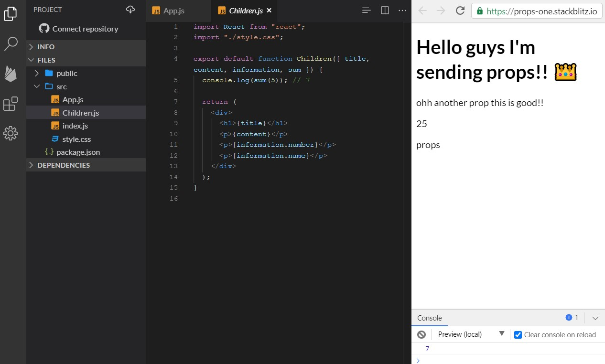
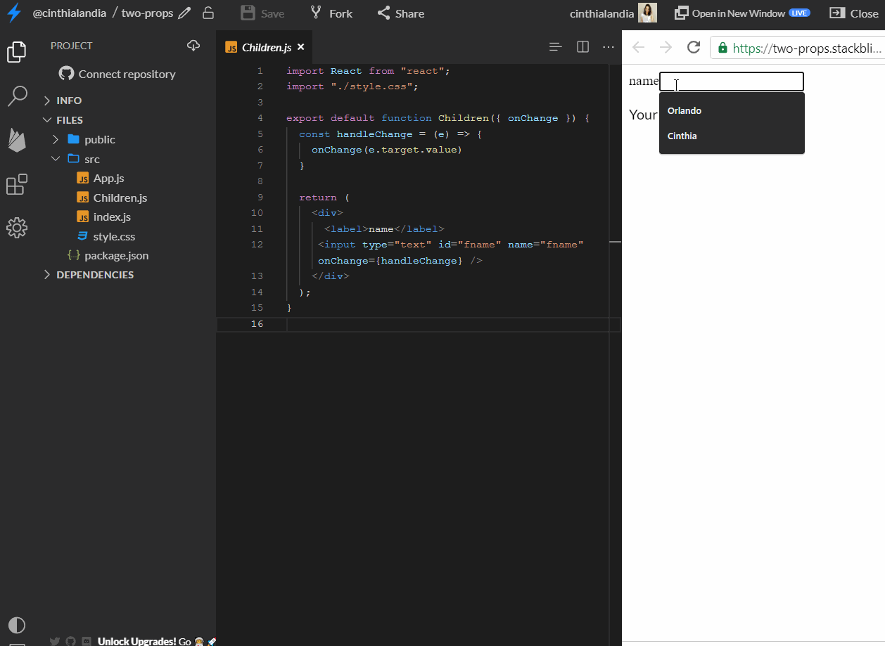
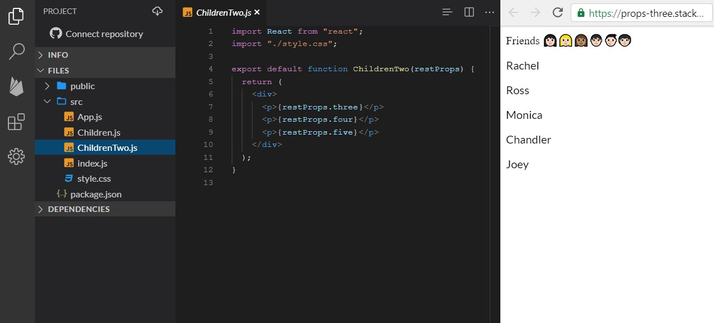
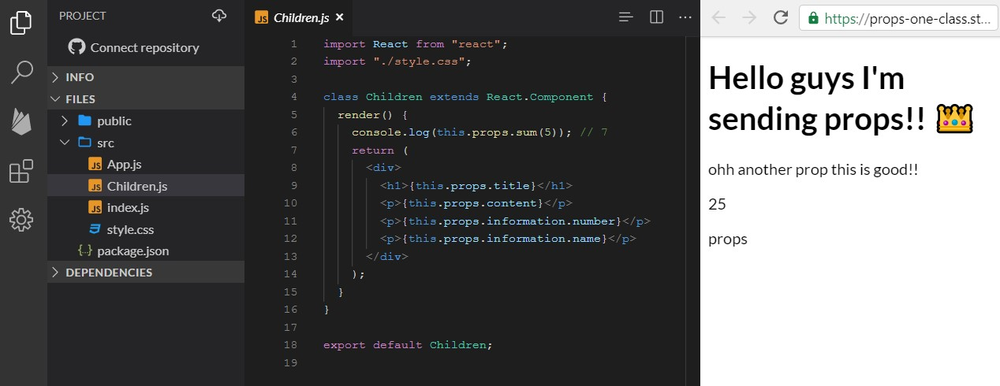

## But first, What are props?

Is a pattern to share information between a father component and a child component, where the father component sets attributes and sends them to the child component as an object. Is important to know that this patter works in a unilateral way, it means that the information is just shared between father to child and not in the other way.

## How to use props?

Props are used for components in react, but the syntax will be vary depending on the type of the component.

For the following examples, we will use them in functional components. At the end of the blog we will do the same examples but with class components.

### Props father to child

We have the example of 2 files called `App` and `Children` where the app will be the father component and the children component will be the child component. In our component, we declared an object called `information`, a function that makes a sum and 2 variables con strings values.

We declared the component child `Children` as part of the render of the component and assign attributes ( any valid name for HTML attributes) all this will be equal to the variable o function to send as a prop.

```jsx
// App.js
import React from "react"
import Children from "./Children"
import "./style.css"

export default function App() {
  const information = { number: 25, name: "props" }

  const funSum = num => {
    return num + 2
  }
  const title = "Hello guys I'm sending props!! 👑"
  const content = "ohh another prop this is good!!"
  return (
    <>
      <Children
        title={title}
        content={content}
        information={information}
        sum={funSum}
      />
    </>
  )
}
```

The functional component `Children` receive props as the first parameter of the function as an object, each name of the property of this object set as an attribute in the father component will be the name of the prop in the child component. A common practice is to deconstruct the received object.

```js
// Chindren.js
import React from "react"
import "./style.css"

export default function Children({ title, content, information, sum }) {
  console.log(sum(5)) // 7

  return (
    <div>
      <h1>{title}</h1>
      <p>{content}</p>
      <p>{information.number}</p>
      <p>{information.name}</p>
    </div>
  )
}
```

### Giving us as a result:



If you want to check the example in real life, click in this link! https://stackblitz.com/edit/props-one?file=src/Children.js

### Props child to father

Yes, you are reading well as I said before props just work in a unilateral way a send information just from the father component to the child component, but there is a way with props to send information from the child component to the father component and is using callbacks!!!

Having an example from before, we declared an input that asks you your name, and at the same time, you are writing your name this will be showing under the input the name you wrote. but this will be rendered from the `App` component.

In this example, in the App component, we declared a state where are we going saving the name that will receive from the child component to be used for the app component, after this is declared a function that is sent as a prop to our child component under the name `onChange`. And for the last is rendered a message with the name written.

```jsx
import React, { useState } from "react"
import Children from "./Children"
import "./style.css"

export default function App() {
  const [name, setName] = useState("")

  const handleNameOnChange = n => {
    setName(n)
  }
  return (
    <>
      <Children onChange={handleNameOnChange} />
      <p> Your name is :{name}</p>
    </>
  )
}
```

On another hand, we have the `children` component that received as a parameter the function `onChange` there is an input in the render component that receives an event handler. In the function called `handleChange` that receives the event of the written name is here where the magic happens, because we use the function from the props and we assign as an argument the information of the event that will be executed in our component app.

```jsx
import React from "react"
import "./style.css"

export default function Children({ onChange }) {
  const handleChange = e => {
    onChange(e.target.value)
  }

  return (
    <div>
      <label>name</label>
      <input type="text" id="fname" name="fname" onChange={handleChange} />
    </div>
  )
}
```

### Giving us as a result:



If you want to check the example in real life, click in this link!!! https://stackblitz.com/edit/two-props?file=src/Children.js

## Props and spread syntax

There are cases when you need to pass the same props through under levels on these cases you can use the syntax spread, but you have to have in mind that just work if that you want to send is an object o can be in an object.

in this example, we have in the father component `App` a series of variables that contain the names of the characters of friends, but this will be rendered for the direct child component and the `childrenTwo` component is the child of the child (yes kind of complex)

```js
import React, { useState } from "react"
import Children from "./Children"
import "./style.css"

export default function App() {
  const nameOne = "Rachel"
  const nameTwo = "Ross"
  const nameThree = "Monica"
  const nameFour = "Chandler"
  const nameFive = "Joey"

  return (
    <>
      <div>Friends 👩🏻👱🏻‍♀️👩🏽🧑🏻👦🏻👨🏻‍🦱</div>
      <Children
        one={nameOne}
        two={nameTwo}
        three={nameThree}
        four={nameFour}
        five={nameFive}
      />
    </>
  )
}
```

Now in our component `Children` we received those props as an (object) and we deconstruct the object props to save in another variable the rest of the object that will be sent to the `ChildrenTwo` component. In the object `Children` we rendered the first two names and declared child `ChildrenTwo` component turning `Children` as the component father.

```js
import React from "react"
import ChildrenTwo from "./ChildrenTwo"
import "./style.css"

export default function Children(props) {
  const { one, two, ...restProps } = props

  return (
    <div>
      <p>{props.one}</p>
      <p>{props.two}</p>
      <ChildrenTwo {...restProps} />
    </div>
  )
}
```

In the component child `ChindrenTwo` we received the props object and rendered the missing names.

### Giving us as a result:



If you want to check the example in real life, click in this link!!! https://stackblitz.com/edit/props-three?file=src/ChildrenTwo.js

## Props with default value

In some cases, we want the props of the component to have a default value that will be used if the father component doesn't send information to the child component.

In this example, we have the father component `App` that rendered a button that when it clicked it will show a phrase but by defect will show another phrase.

```js
import React, { useState } from "react"
import Children from "./Children"
import "./style.css"

export default function App() {
  const [state, setState] = useState()

  const handleClick = () => {
    setState(true)
  }

  return (
    <>
      <button onClick={handleClick}>Click me!!! 🍕</button>
      <Children state={state} />
    </>
  )
}
```

The rendered of this phrase is in the child component `Children` that it will receive the props value `true` and will print a phrase, if this is not received, the value will be by default `false`.

```js
import React from "react"
import ChildrenTwo from "./ChildrenTwo"
import "./style.css"

export default function Children({ state = false }) {
  return <div>{state ? <p>On!!! 😮</p> : <p>Off!!! 😴</p>}</div>
}
```

### Giving us as a result:


If you want to check the example in real life, click in this link!!! https://stackblitz.com/edit/props-four?file=src%2FChildren.js

### Another way to assign props by defect

Using the syntax `defaultProps` in the last example the `App` component will be declared as the same. but at the moment to receive the prop the `Children` component is declared the name of the component follow by a dot and the `defaultProps` syntax, and declared the object where we assign the value by default of the properties. Important to know this will be declared outside of the child component.

```js
import React from "react"
import "./style.css"

export default function Children({ state }) {
  return <div>{state ? <p>On!!! 😮</p> : <p>Off!!! 😴</p>}</div>
}

Children.defaultProps = {
  state: false,
}
```

### Giving us as a result:


If you want to check the example in real life, click in this link!!! https://stackblitz.com/edit/props-five?file=src/Children.js

## Props and typescript

To use props in react with typescripts necessary write more code and declare interfaces, so we need to go step by step. We must clarify that in this part of the blog we will be using the same previously examples and were just explain the typescript part.

### Props father to child

As a father component is not necessary to declare something extra for typescript. But in the child component is necessary to declare an interface for the props we are going to receive and the type of each one, as an addition, we need to declare in the function component the syntax `React.FC<Props>`, that tells to typescript that we have a functional component and its receiving `Props`

```typescript
import React from "react"
import "./style.css"

interface Props {
  title: string
  content: string
  information: { number: number; name: string }
  sum: (n: number) => number
}

const Children: React.FC<Props> = ({ title, content, information, sum }) => {
  console.log(sum(5)) // 7

  return (
    <div>
      <h1>{title}</h1>
      <p>{content}</p>
      <p>{information.number}</p>
      <p>{information.name}</p>
    </div>
  )
}

export default Children
```

### Giving us as a result:


If you want to check the example in real life, click in this link!!! https://stackblitz.com/edit/props-one-typscrit?file=Children.tsx

### Props child to father

Taking a previous example of the input, the father component `App` is the one that is sending the props it's not necessary to add something for typescript. We need to add the interface for the child component `Children` we declared the function `onChange` and add the syntax to the functional component for typescript. As you can see in this example we are not doing any changes for the father component because the component its receiving the information by a callback but sending this function as a props.

```typescript
import React from "react"
import "./style.css"

interface Props {
  onChange: (n: string) => void
}

const Children: React.FC<Props> = ({ onChange }) => {
  const handleChange = (e: React.ChangeEvent<HTMLInputElement>) => {
    onChange(e.target.value)
  }

  return (
    <div>
      <label>name</label>
      <input type="text" id="fname" name="fname" onChange={handleChange} />
    </div>
  )
}

export default Children
```

### Giving us as a result:


If you want to check the example in real life, click in this link!!! https://stackblitz.com/edit/props-two-typescrit?file=Children.tsx

## Props and class components

### Props father to child

The class components receive props as properties of the instance of the component and it could access to them using the syntax `this.props`

We have the previous example but this time with class components and props will be sent in the same way to the child component.

```typescript
import React from "react"
import Children from "./Children"
import "./style.css"

class App extends React.Component {
  state = {
    information: { number: 25, name: "props" },
    title: "Hello guys I'm sending props!! 👑",
    content: "ohh another prop this is good!!",
  }

  funSum = num => {
    return num + 2
  }
  render() {
    return (
      <div>
        <Children
          title={this.state.title}
          content={this.state.content}
          information={this.state.information}
          sum={this.funSum}
        />
      </div>
    )
  }
}

export default App
```

In the component `Children` who receive the props, it will receive those as properties of the class and they don't have to be extracted from any object. We declared the props with the keyword `this` (magic) which one will be rendered.

```typescript
import React from "react"
import "./style.css"

class Children extends React.Component {
  render() {
    console.log(this.props.sum(5)) // 7
    return (
      <div>
        <h1>{this.props.title}</h1>
        <p>{this.props.content}</p>
        <p>{this.props.information.number}</p>
        <p>{this.props.information.name}</p>
      </div>
    )
  }
}

export default Children
```

### Giving us as a result:


If you want to check the example in real life, click in this link!!! https://stackblitz.com/edit/props-one-class?file=src%2FChildren.js

## Props and typescript in class components

In the father component `App` we declared the props with no extra. But in the child component `children` we declared the interface whit the props as properties and their types, we modify the syntax of the class component adding `<Props>` and declared the props with the keyword `this` (magic!).

```typescript
import React from "react"
import "./style.css"

interface Props {
  title: string
  content: string
  information: { number: number; name: string }
  sum: (n: number) => number
}

class Children extends React.Component<Props> {
  render() {
    console.log(this.props.sum(5)) // 7
    return (
      <div>
        <h1>{this.props.title}</h1>
        <p>{this.props.content}</p>
        <p>{this.props.information.number}</p>
        <p>{this.props.information.name}</p>
      </div>
    )
  }
}

export default Children
```

### Giving us as a result:


If you want to check the example in real life, click in this link!!! https://stackblitz.com/edit/props-typscrit-class?file=Children.tsx
