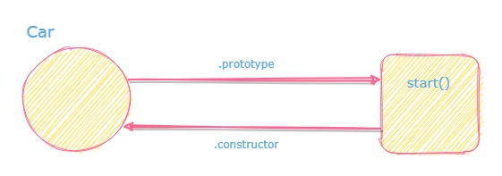
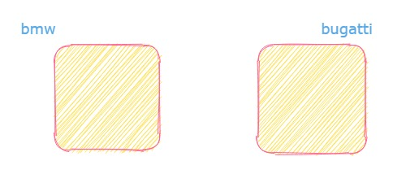
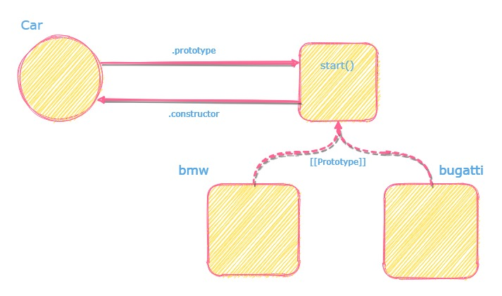
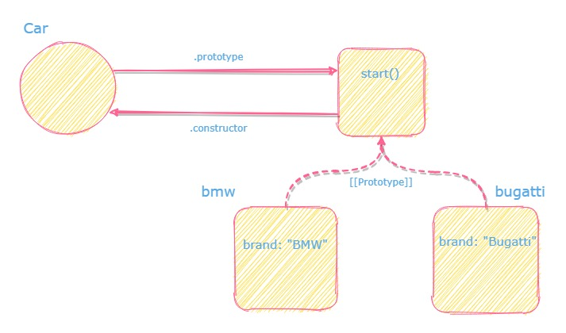
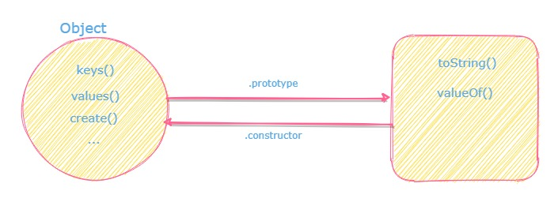
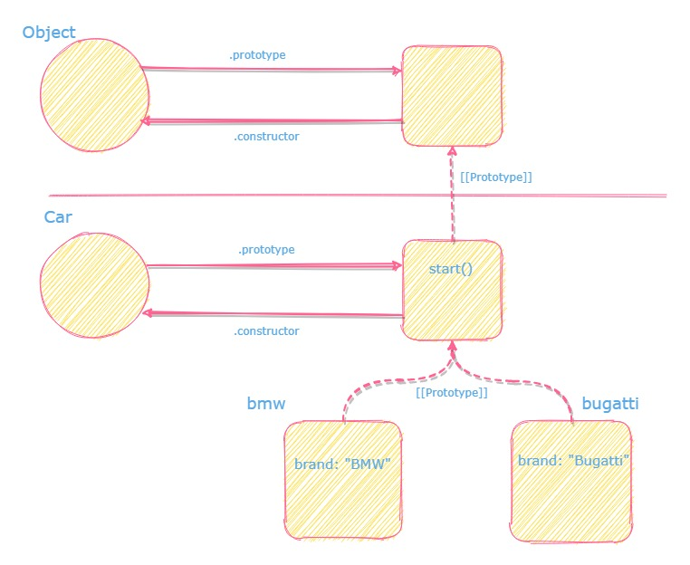
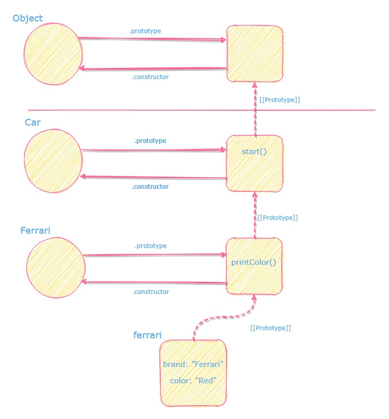

_Colaboración con [Gerardo Leal](https://www.linkedin.com/in/gdlm91/)_

## Clases en JavaScript

En ES2015, el termino `class` fue introducido para proveer una sintaxis más limpia al momento de crear objetos en javaScript y al mismo tiempo que fuera más familiar a otros lenguajes de programación `Object Oriented Programming (OOP)` como java o C++.

En javascript, la definición de una clase se ve asi:

```jsx
class Car {
  constructor(brand) {
    this.brand = brand
  }

  start() {
    console.log("starting car of brand", this.brand)
  }
}

const bmw = new Car("BMW")
const bugatti = new Car("Bugatti")
```

Antes de ES2015, era requerida una sintaxis distinta para declarar lo mismo.

```jsx
function Car(brand) {
  this.brand = brand
}

Car.prototype.start = function () {
  console.log("starting car of brand", this.brand)
}

const bmw = new Car("BMW")
const bugatti = new Car("Bugatti")
```

Pero en la práctica ambos trabajan de la misma manera, `class` es una función especial y es declarada con diferente sintaxis.

## Prototype

La programación basada en `prototype` es un estilo de programación orientada a objetos en la que es posible reutilizar el comportamiento (herencia) mediante el uso de objetos existentes que sirven como “prototipos”. Entonces una clase (en su forma estricta) realmente nunca se define, sino que se crea un objeto y se reutiliza como la implementación para otros objetos.

Todo esto es posible gracias a un link especial entre objetos llamado `[[Prototype]].`

### El objeto prototype



Cuando una función es definida, un objeto llamado `prototype object` es creado en memoria y es conectado a él vía la propiedad `.prototype`. Se crea también una conexión recíproca desde ese objeto hasta la función llamada propiedad `.constructor`.

Como se puede observar en el ejemplo de la función, se puede interactuar directamente con ese objeto usando la propiedad `prototype`, en este ejemplo hemos declarado el método `start()` de nuestro `Car.`

Con la sintaxis `class`, la implementación está escondida de nosotros, pero está ocurriendo exactamente el mismo proceso.

### El [[Prototype]] chain

```jsx
class Car {...}

const bmw = new Car("BMW");
const bugatti = new Car("Bugatti");
```

Cuando un nuevo objeto es creado usando `new Car(..)` una serie de operaciones son ejecutadas.

**1. Un objeto completamente nuevo es creado en memoria.**

Este objeto se encuentra completamente vacío (sin metodos, sin propiedades).



**2. La conexión [[Prototype]] es creada .**

En este punto el objeto es completamente conectado al `prototype object` de la función (o clase) `Car`.



**3. La función es ejecutada usando el nuevo objeto creado como valor del `this`. Esta acción es llamada `constructor call`**

En este punto donde la propiedad del objeto es definida y asignada, es importante aclarar que cada propiedad es definida dentro de CADA objeto y no es parte de `property object` `Car`.

En el caso de la sintaxis `class` el método constructor es quien es ejecutado en esta etapa.



Piensa que Javascript llama la función `Car` de esta manera:

```jsx
function Car(brand) {
  this.brand = brand
}

const bmw = Car.apply({}, "BMW") // {} Es el objeto nuevo creado en memoria i

// No es lo que realmente esta pasando pero sirve para ilustrar
// Como el nuevo objeto obtiene la propiedad definida?
```

**4. Una referencia de este nuevo objeto es retornada.:**

Y generalmente esa referencia es guardada en una variable (`bmw` y `bugatti` en este ejemplo) que se usa para acceder al objeto.

```jsx
class Car {...}

const bmw = new Car("BMW"); // Se guarda una referencia en el objeto con la marca "BMW"
const bugatti = new Car("Bugatti"); // Se guarda una referencia en el objeto con la marca "bugatti"
```

### Describiendo el **[[Prototype]] chain**

Cuando ejecutamos el método `start` en cada objeto, 2 cosas pasan:

```jsx
class Car {...}

const bmw = new Car("BMW");
const bugatti = new Car("Bugatti");

bmw.start() // comenzando car de la marca BMW
bugatti.start() // comenzando car de la marca BMW  Bugatti
```

**1. Encontrando el método en el [[Prototype]] chain**


Si vemos el diagrama y observamos al nuevo objeto creado, nótaras que no se encuentra ningún método llamado `start`, solo se encuentra la propiedad `brand`, entonces ¿Como se ha podido ejecutar el método?

Javascript tiene un comportamiento especial en los objetos cuando trata de obtener un metodo de ellos. Si no pueden encontrarlo, seguirá el `[[Prototype]] chain` hasta el el siguiente objeto con el cual está conectado y buscará en él, y continuará buscando de objeto en objeto hasta que consiga el método y se ejecute, o muiestre un error.

Esto es lo que hace posible que `bmw` y `bugatti` puedan usar el método `start()` de la propiedad del objeto `Car`

**2. Usando el objeto como valor del `this`.**

La segunda parte de la magia es realmente algo que vimos antes ¿Como la correcta `brand` se muestra en consola?

Como anteriormente explicamos en el de [this](/es/blog/this/), la regla `implict binding` dicta que cuando la función es ejecutada como método de un objeto, ese objeto es usado como el valor de `this`.

Por lo tanto no importa donde el `[[Prototype]] chain` encuentre a la función, al haber sido llamado como método del objeto `bmw` o `bugatti`, el valor de `this` es correctamente aplicado.

**No es magia, es solo javaScript siguiendo las reglas que ya sabemos.**

### El final del [[Prototype]] chain

Ya sabemos como javascript encuentra un método o propiedad en el `[[Prototype]] chain` , pero ¿Cuando termina este comportamiento?

Hay una clase que técnicamente es la clase original llamada `Object` (con O mayúscula) y tiene su propio `prototype object`, al cual todos los objetos de javascript están conectados, directa o indirectamente a este objeto a través del `[[Prototype]] chain.`

Este `objeto` tiene una colección de métodos y propiedades que podrían ser familiares:



Por lo tanto la búsqueda en el `[[Prototype]] chain` termina cuando este encuentra este `Objeto`:



Todos los demás objetos primitivos como `Functions`, `Strings` or `Numbers` están conectados a este objeto original también.

## Prototypal Inheritance

Es posible en javascript extender la `class` creando otro que tenga el comportamiento de aquel que se extendió, más nuevas características. Pongamos por ejemplo que creamos la `class ferrari` que es un car con la `brand` y un método `start()`, pero tiene más características como una limitada cantidad de colores.

Con ES2015, la sintaxis podría verse de esta manera usando la palabra `extends`:

```jsx
class Car {
  constructor(brand) {
    this.brand = brand
  }

  start() {
    console.log("starting car of brand", this.brand)
  }
}

class Ferrari extends Car {
  constructor(color) {
    // Llamando el metodo constructor de la clase car . Todo los ferrari son brand "Ferrari"
    super("Ferrari")

    // Es mostrado un error si setea un color invalido
    if (color !== "Yellow" && color !== "Red") {
      throw new Error("Ferrari should only be of color yellow or red...")
    }

    this.color = color // De otra manera, se setea el color
  }

  printColor() {
    console.log("This Ferrari is of color", this.color)
  }
}

const ferrari = new Ferrari("Red")
ferrari.start() // Comenzando el car de brand ferrari
console.printColor() // Este ferrari es de color rojo
```

Probablemente estás tentando a pensar que extendiendo la `class Car`, estas también creando una copia de todos sus métodos y propiedades y agregándole a `Ferrari`. Pero no, estamos es realizando una conexión entre los objetos.



Nótese que la llamada `super()` en `Ferrari` constructor. Esa palabra especial que viene con la sintaxis `class` para llamar al constructor y extender a `class Car`. Esta llamada es la que inicializa la propiedad `brand` en `Ferrari`.

Cuando ejecutamos el método, el mismo principio del `[[Prototype]] chain` es aplicado. Si un método no existe en el objeto, el buscara en la siguiente conexión hasta encontrar o fallar. Es por esto que nuestro `Ferrari` tiene tambien el metodo `start()`

Lo mismo se puede lograr con funciones simples y manipulación de prototipos directamente, pero probablemente notará que implica un poco más de código y saber qué vincular:

```jsx
function Car(brand) {
  this.brand = brand
}

Car.prototype.start = function () {
  console.log("starting car of brand", this.brand)
}

function Ferrari(color) {
  Car.call(this, "Ferrari") // La llamada del constructor tambien inicializa lo que hace el car

  // Muestra un error al setear un color invalido
  if (color !== "Yellow" && color !== "Red") {
    throw new Error("Ferrari should only be of color yellow or red...")
  }

  this.color = color // si no setea el color
}

// Object.create Crea un objeto vacio y lo conecta a un objeto
// Se conecta paso 1 y paso 2 llamando new
Ferrari.prototype = Object.create(Car.prototype)

Ferrari.prototype.printColor = function () {
  console.log("This Ferrari is of color", this.color)
}

const ferrari = new Ferrari("Red")
ferrari.start() // comenzando car de la brand ferrari
console.printColor() // Este ferrari es rojo
```

## Classical OOP vs Prototypal

_JavaScript OOP son solo objetos vinculados a otros objetos ..._

### Las clases no son realmente clases

En la OOP clásica, las clases sirven como un "modelo" de cómo debería verse un objeto, son solo abstracciones. Lo único que puede hacer con ellos es "crear objeto" o extenderlos.

Como ha visto, incluso si JavaScript ahora incluye una palabra clave `class` (con`super` y `extend`), son solo funciones con objetos vinculados a ellas, y son los objetos los que tienen una implementación de métodos y propiedades.

### Los objetos no obtienen una copia de los métodos cuando se instancian

En la OOP clásica, cada objeto creado también recibe una copia de los métodos y propiedades que define la clase.

Con el prototipo de OOP, los objetos no obtienen una copia, sino un link a otro objeto que ya tiene la implementación, y se basa en la "delegación de comportamiento" para lograr el efecto de herencia.

### Puede agregar métodos y propiedades en tiempo de ejecución a prototipos

En la OOP clásica, no puede agregar más propiedades o métodos a una clase en tiempo de ejecución. Todo sucede cuando escribes y compilas tu código.

En prototypal OOP, puede agregar más métodos y propiedades a una clase en tiempo de ejecución, y todos los objetos vinculados al objeto de la clase también tendrán acceso a estas nuevas propiedades / métodos:

```jsx
class Car {
  constructor(brand) {
    this.brand = brand
  }
}

const bmw = new Car("BMW")

function addStop() {
  Car.prototype.stop = function () {
    console.log("stoping car of brand", this.brand)
  }
}

// ...

addStop()

// Ahora bmw tiene el nuevo metodo

bmw.stop() // se para el car de la brand BMW
```

## Técnicas OOP con prototype

### Método Shadowing

Hay casos en que uno de los objetos necesita un comportamiento específico para un método de herencia. Para esto, hay una manera de agregar un método con el mismo nombre e incluso reutilizar parte de la lógica del método original si es necesario

```jsx
class Car {
  constructor(brand) {
    this.brand = brand
  }

  start() {
    console.log("starting car of brand", this.brand)
  }
}

const ferrari = new Car("Ferrari")

// Metodo shadowing
ferrari.start = function () {
  this.start()
  console.log("FERRARI BABY!!!")
}

ferrari.start()
// Comenzado el car de la brand Ferrari
// FERRARI BABY!!!
```

Un escenario más práctico es cuando se extienden las clases, y la nueva clase necesita un comportamiento diferente para el mismo método:

```jsx
class Car {
  constructor(brand) {
    this.brand = brand
  }

  start() {
    console.log("starting car of brand", this.brand)
  }
}

class Ferrari {
  constructor() {
    super("Ferrari")
    this.started = false
  }

  start() {
    super.start() // calling Car.start
    this.started = true
  }
}

const ferrari = new Ferrari()

ferrari.start() // Comenzado el car de la brand Ferrari
ferrari.started // true
```

### Método Static

En OOP hay una noción de métodos estáticos. Los métodos estáticos no se invocan en instancias de la clase. En cambio, son llamados a la clase misma. Estas son a menudo funciones de utilidad, como funciones para crear o clonar objetos.

Para la sintaxis `class` de ES2015, se proporciona una palabra clave especial`static`:

```jsx
class Car {
  constructor(brand) {
    this.brand = brand
  }

  start() {
    console.log("starting car of brand", this.brand)
  }

  static isColorVailable(color) {
    const availableColors = ["red", "blue"]

    return availableColors.includes(color)
  }
}

const ferrari = new Car("Ferrari")

ferrari.isColorVailable("blue") // TypeError: ferrari.isColorVailable is not a function

Car.isColorVailable("blue") // true
```

## Referencia

- https://developer.mozilla.org/en-US/docs/Web/JavaScript/Reference/Classes
- https://developer.mozilla.org/en-US/docs/Glossary/Prototype-based_programming
- https://developer.mozilla.org/en-US/docs/Web/JavaScript/Reference/Global_Objects/Object/proto
- https://developer.mozilla.org/en-US/docs/Web/JavaScript/Reference/Classes/static
- https://en.wikipedia.org/wiki/Prototype-based_programming
- https://frontendmasters.com/courses/deep-javascript-v3/prototypes/
- You Don't Know JS: This and Object Prototype: Book by Kyle Simpson
