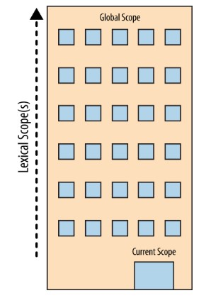

## ¿Que es scope?

El scope se define como el tiempo de vida y visibilidad de una variable. Las variables no son visibles fuera del scope donde fueron declaradas.

JavaScript tiene module scope,, function scope, block scope, lexical scope y global scope.

### Lexical vs Dynamic scope

Javascript usa lexical scope. En el lexical scope (estático), la estructura de la fuente del código del programa determina a qué variables a que variables te refieres. Con scopes dinámicos el tiempo de correr del estado del programa determina a qué variables te refieres.

### ¿Como funciona el lexical scope en Javascript?

```js
X = 42
console.log(y)
```

Javascript organiza el scope con funciones y bloques, y tiene 2 actores trabajando en esto, el primero es el compilador, el cual procesa el programa javascript y el otro es el administrador del scope, el administrador hace el trabajo de colocar las variables y funciones donde pertenece en el código. Es decir cuando el compilador dice tengo esta variable, el administrador tiene un plan para esa variable, esto descrito es la primera parte de nuestro compilador, después de todo estos planes, haber declarado todo en nuestro código, pasamos a la parte de ejecución del mismo.

Con este ejemplo vamos a explicar cómo el scope funciona.

```js
const name = "Cinthia"

function otherName() {
  const name = "Janeth"
  console.log("Hello!")
}

function other() {
  var answer = "maybe?"
  console.log(answer)
}

otherName() // hello!
other() // maybe?
```

Para explicar scope, primero tenemos que definir algunos puntos y es que todo programa tiene un scope global que es donde se declaran todas las funciones y variables en nuestro código, y dentro de ese scope global, se irán creando sub scopes que es todo aquello que se encuentre dentro de llaves, o mejor llamados `block scope`, si usamos una analogía, sería tener una caja muy grande (scope global) el cual tiene cajas medianas (sub scope), y dentro de estas cajas medianas, tenemos mas cajas pequeñas (sub scopes de nuestros sub scope) , es decir cajas, dentro de cajas sin ningún límite. Teniendo esto claro, al momento de la declaración y compilación de nuestro código pasan 2 cosas, la primera es la declaración de todo que se hace con el manager scope y el compilador y el segundo es nuestro javascript engine y manager.

Primero se crean nuestras `declaration expressions` en nuestra caja grande que sería el scope global de todo aquello que es declarado, en nuestro código vemos nuestro const name y el compilador le preguntara al manager scope si existe una variable const llamada `name` como este no existe, se creará en memoria, luego pasaremos a nuestra función `otherName` y se declarara en memoria, pero esto al ser una función es decir un bloque con llaves, crea un sub scope, por lo que crea un scope local, en el cual vemos una declaración de una variable `name`, y se pregunta en este scope local si existe esta variable, como la respuesta es no, ya que en ese scope local no es el mismo al global, la declaramos en memoria, y pasamos a nuestra próxima función `other` creando otro sub scope local, en el cual tenemos la declaración `answer` que será creada en memoria.

Creada todas nuestras declaraciones, pasamos a la segunda parte del compilado donde se crean las `executed expressions` que es donde se asignan valores y se ejecutará expresiones declaradas, en esta parte nuestro javascript engine le preguntara a nuestro manager scope, hey tenemos un valor `cinthia` para una declaración `name` y nuestro manager scope sabrá dónde colocar ese valor, ya que name es una variable que existe, pasado esto vamos hasta nuestra ejecución de la función `otherName` y preguntamos si se encuentra una función declarada que podamos ejecutar, y nuestro scope manager ejecutará la misma donde se encuentre declarada, haciendo lo mismo con nuestra ejecución `other`, el cual en ambas funciones tenemos 2 valores a asignar y 2 console.log que ejecutar. Dano todo este código como resultado en las consolas `Hello` y `maybe`.

## Los scope pueden estar anidados

Dijimos que el scope, es el lugar donde se buscan variables, funciones de acuerdo a su identificación. Usualmente hay más de un scope a considerar. A veces bloques o funciones que están anidadas dentro de otro bloque o función, los scopes están anidados dentro de otros scope. Así que si una variable no puede ser encontrada en su scope inmediato, el motor de javascript consultara el próximo scope, continuando hasta conseguirlo o hasta llegar al tope (global scope).

```js
let name = "Cinthia!"

function otherName() {
  let name = "Gerardo"

  function sayAge(age) {
    console.log(name, age) // 'Gerardo' 23
  }

  sayAge(23)
}

otherName()
```

En este ejemplo, tenemos una variable `name` declarada con un valor de string, después tenemos una función llamada `otherName` con una variable name y una función `sayAge` que imprime en consola las variables `name` y `age`, todas estas declaraciones son hechas en el primera parte de la compilación, luego la segunda parte la compilación ejecutaremos las llamada de la función `sayAge`, que en este caso no será ejecutado hasta que se haga la ejecución a la función `otherName` porque la misma es una expresión de la función `otherName` en su scope. Teniendo esto claro en la function `sayAge` hay una consola que imprime las variables, age es recibida como parámetro pero age será buscada por javascript primero en su propio scope y como no lo encontrara lo buscara en su siguiente scope el de la función `otherName`, donde si se encuentra name con un valor asignado en esta casi el valor `Gerardo`.

### Para visualizar el proceso de anidado en el scope, quiero que pienses la analogía de un edificio.



El edificio representa nuestro anidado scope del programa. En el primer piso el edificio representa tu actual scope de ejecución donde sea que estés. El último piso del edificio es el global scope.

Resolveras la `declaration expression` y `execute expression` buscando en el piso donde te encuentres, si no lo encuentras tomarás el elevador hasta el siguiente piso, buscaras en el, y si no se encuentra buscaras en el siguiente, así sucesivamente hasta que llegues al último piso (global scope) hayas encontrado o no lo que buscabas. Es importante saber que esto en el scope funciona buscando de abajo hacia arriba (desde el primer piso hasta el último) y no al revés.

## Caso especial con Var

```js
function hi(condition) {
  let name = "Cinthia"
  if (condition) {
    let name = "Gerardo"

    console.log(`Hi ${name}`) // 'Hi Gerardo'
  }

  console.log(name) // 'Cinthia'
}

hi(true)
```

```js
function hi(condition) {
  var name = "Cinthia"
  if (condition) {
    var name = "Gerardo"

    console.log(`Hi ${name}`) // 'Hi Gerardo'
  }

  console.log(name) // 'Gerardo'
}

hi(true)
```

En este ejemplo tenemos el mismo ejercicio pero se diferencian en el uso de variables en uno se utiliza la variable `var` y en la otra la variable `let`, y como podemos observar a pesar de ser el mismo ejercicio tenemos resultados distintos ¿por que sera? Y aquí hablamos de algo interesante sobre el comportamiento de var en los scope, a diferencia de let o const este no se declara a nivel de bloque o llaves sino a nivel de funciones.

Tanto en el primero como segundo ejercicio declaramos una función `hi` con una variable con valor `cinthia`, y una condición que si es true se le asigna a la variable name el valor de `Gerardo` e imprime un mensaje con el valor de name, fuera de esta condición, tenemos otro console.log que nos imprime el valor name y finalmente invocamos nuestra función.

En nuestro primer ejercicio, tenemos la primera consola imprimiendo `Hi gerardo` el cual es asignado por nuestra condición y ambos ejercicios tienen el mismo resultado, pero cuando vamos al segundo console.log que se realiza al nivel de la función, fuera de la condición, vemos que el primer ejemplo imprime `cinthia`, que es el valor de esa variable en ese scope, pero en nuestro segundo ejemplo vemos que imprime el valor `Gerardo` imprimiendo el valor de la condicion, ¿por que pasa esto?, porque var es declarado a nivel de funciones, por lo que se convierte en una declaración no de la condición sino de la función en general lo que causaría la reasignación de esa variable al momento de asignar valores.

## Closure

Closure es cuando una función “recuerda” su lexical scope (alcance) aun cuando esta es ejecutada afuera de su lexical scope.

```js
function somenthing(cb) {
  setTimeout(cb, 3000)
}

;(function () {
  const name = "walter"

  somenthing(() => {
    console.log(name) // 'walter'
  })
})()
```

En este ejemplo, tenemos una función `something` que tiene un setimeout con 3000 milisegundos y dentro de esa función tenemos una variable, dentro de esa función estamos ejecutando la función `somenthing` con la variable `name`, donde la consola imprimirá el nombre `walter`, esto es un caso de closure porque la función ejecutada retorna un arrow function que recuerda y tiene acceso a la variable name, aun cuando esta no está siendo ejecutada en el scope donde fue declarada.

```js
function createCounter() {
  let count = 1

  return function () {
    count++

    return count
  }
}

let counter = createCounter()
console.log(counter()) // 2
console.log(counter()) // 3
console.log(counter()) // 4
```

Este es otro ejemplo de closure, nosotros tenemos una función `createCounter` que tiene un variable `count` que retorna una función que ejecuta una suma en el `count` retornando la cuenta total, y fuera de la función estamos guardando la función general en una variable, creando una function expression. Ejecutamos la función llamada por el nombre de su variable y como podemos observar en la consola, la primera devuelve el número 2, la segunda devuelve el número 3 y la 3era devuelve el número 4. ¿por que pasa esto? Porque es un closure y cada vez que ejecutemos la función, este retorna el resultado de la suma en la función, porque está recuerda el scope donde fue declarada por lo tanto ese scope no puede morir, ya que alguien tiene una referencia al mismo, por lo que guarda la cantidad sumada que tenemos.

```js
for (var i = 1; i <= 5; i++) {
  setTimeout(function timer() {
    console.log(i) // 6 6 6 6 6
  }, i * 1000)
}
```

Closure en bucles, en este ejemplo es bastante interesante ya que está pasando algo diferente cuando utilizamos la variable var. Tenemos un for declarado, con una `i` igual a uno, una condición de `i` menor o igual a 5 y una expresión donde si esto no es true se la suma uno a `i`, y esto tiene como expresión un settimeout que tiene como función que ejecuta un console.log que imprime el valor de `i` cada 1000 milisegundos. Como puedes ver la consola imprime `6 6 6 6 6` en vez de `1 2 3 4 5` ya que en este caso var se re asigna en cada bucle del `for`, dejando en claro que primero se realiza la ejecución del for y por último el settimeout.

## Immediately Invoking Function Expressions IIFE

Podemos ejecutar una función adicionando otro () al final, como (function foo(){ .. })().. El primer cierre de paréntesis hace que la función sea una expresión y el segundo par de paréntesis ejecuta la función. Con esta expresión creamos un scope local.

```js
let name = "Cinthia"

;(function anotherName() {
  let name = "Gerardo"
  console.log(name) // 'Gerardo'
})()

console.log(name) // 'Cinthia'
```

En este ejemplo tenemos una variable declarada y una función llamada `anotherName`, que está siendo encerrada en 2 parentesis y 2 mas al final de la misma para ser invocada inmediatamente, al momento de correr javascript.

## Referencias

- https://www.freecodecamp.org/news/an-introduction-to-scope-in-javascript-cbd957022652/
- You Don't Know JS: Scope & Closures: Book by Kyle Simpson
