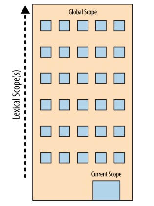

## What’s scope?

Scope defines the lifetime and visibility of a variable. Variables are not visible outside the scope in which they are declared.

JavaScript has module scope, function scope, block scope, and global scope.

### Lexical vs Dynamic scope

JavaScript uses lexical scope. With static (lexical) scoping, the structure of the program source code determines what variables you are referring to. With dynamic scoping, the runtime state of the program stack determines what variable you are referring to

### How does lexical scope work in JavaScript?

```js
X = 42
console.log(y)
```

JavaScript organizes scopes with functions and blocks. And have two actors working on it, the first one is the compiler, the thing that’s processing the JavaScript program, and the other one is the scope manager, and scope manager is the one that makes the administration that variables and other stuff have to be in the code. So when the compiler says, hey, I have this thing, the scope manager says, I’m gonna make a plan for that. That would be our first pass through the program, is the compilation step, and then after we’ve set up all those plans, then we’ll come back and execute the code.

For this example we are going to explain how the scope works.

```js
const name = "Cinthia"

function otherName() {
  const name = "Janeth"
  console.log("Hello!")
}

function other() {
  var answer = "maybe?"
  console.log(answer)
}

otherName() // hello!
other() // maybe?
```

To explain the scope, first, we need to define some points, in a JavaScript program, we have a global scope where are all the variable declarations, functions in our code and inside of this global scope, there are creating sub scopes, those scopes are everything inside curly braces o other words the called `block scope`. If we use an analogy, the global scope is like a big box (global scope) inside of this big box there are medium boxes (sub scopes) and inside of this medium boxes are small boxes (sub scopes inside in another sub-scope) it means boxes inside boxes without a limit. Having this clear at the moment in the declaration and compiling our code pass through 2 steps, first is the declaration about everything in the code with the manager scope and the compiler and the second step is the JavaScript engine and manager.

First, there will create `declaration expressions` in our big box, that is the global scope where everything is declared, in our example have the first variable declaration `const name` and the compiler will ask the scope manager if there is any `name` variable in the global scope? The manager will say no and will be created in memory. Then we have the declaration function `otherName` and the compiler will ask the same question and will create the function declaration, inside of this function creates a local scope (sub-scope) in the global scope because we have a function or block-scope and inside of this function there is a `name` variable declared, the compiler will ask the same question, and will create this name variable because the variable doesn't exist in this local scope. Then it will pass to the other declaration function creating another local scope (sub-scope) with the declarations inside the first part completed

The second part is when all the declaration was created and the part of the compile all the `executed expression` will create where assign values to the variables and will executed expressions, in this part the JavaScript engine will ask to the manager scope, that in this case has the `Cinthia` value and the scope manager will know where to assign. After that, the engine will execute the called `otherName`, and the manager's scope will look where was declared that function and will execute the expression, inside that function as we said later we have the value `Janeth` to the variable name and execute the console.log. After this will execute the other function with the expression and finalized our second step in the compiled code with the result in the console with `Hello` and `maybe` .

## Scopes can be nested

We said that Scope is a set of rules for looking up variables by their identifier name. There's usually more than one Scope to consider. Just as a block or function is nested inside another block or function, scopes are nested inside other scopes. So, if a variable cannot be found in the immediate scope, Engine consults the next outer containing scope, continuing until found or until the outermost (aka, global) scope has been reached.

```js
let name = "Cinthia!"

function otherName() {
  let name = "Gerardo"

  function sayAge(age) {
    console.log(name, age) // 'Gerardo' 23
  }

  sayAge(23)
}

otherName()
```

In this example, we have the variable `name` declared with a value string and after that the function `otherName` is declared with a another name value and another function called `sayAge` that print in a console the variables name and age, all this declaration are declared in the first step in the scope and then in the second compile, assign the values and executed the functions. In this case we have the execution `sayAge` that is not executed until the function `otherName` is executed because this function is the expression in the function scope. Having this clear in the function `sayAge` there is a console printing the variable name and age, age is received as a parameter but name is no in the scope of their own function, so JavaScript go to the next up level scope and look for the variable name where in this case the value is `Gerardo`.

### To visualize the process of nested Scope resolution, I want you to think of this tall building.



The building represents our program's nested Scope rule set. The first floor of the building represents your currently executing Scope, wherever you are. The top level of the building is the global Scope.

You resolve `declaration expression` and `execute expression` by looking on your current floor, and if you don't find it, taking the elevator to the next floor, looking there, then the next, and so on. Once you get to the top floor (the global Scope), you either find what you're looking for, or you don't. But you have to stop regardless. It is important to know that the scope works just looking from bottom to top and not backward.

## Special case with var 

```js
function hi(condition) {
  let name = 'Cinthia';
  if (condition) {
    let name = 'Gerardo';
    
    console.log(`Hi ${name}`); // 'Hi Gerardo'
  }
  
  console.log(name) // 'Cinthia'
}

hi(true);
```

```js
function hi(condition) {
  var name = 'Cinthia';
  if (condition) {
    var name = 'Gerardo'; 
    
    console.log(`Hi ${name}`);// 'Hi Gerardo'
  }
  
  console.log(name) // 'Gerardo'
}

hi(true);
```

In this example, we have the same exercise but using different variables, in the first case we are using `let` and in the second we are using `var `, and even having the same example we have different results, why is that? And here we can see something interesting about the `var` behavior in scopes. `let` and `const` are declared at the block or key level but `var` is declared at the function level.

As the first example and the second, we declared a function `hi` with a variable with `cinthia` value and a condition that if is true it will assign the variable name the value `gerardo` and will print a message with the value name, outside of this condition there is another console.log that print another value name and finally the function is invoked. 

In out first exercise, we have the first console.log printing `Hi gerardo` that was assigned for our condition and both has the result, but when observe the second console.log that is declared as a function level, the first example prints `cinthia` and the second one `gerardo`, why is this happening? So the second variable is declared at the function level and not at the condition, causing that when assigning values, name is reassigned with another value in the condition instead of creating a new variable.

## Closure 

Closure is when a function “remembers” its lexical scope even when the function is executed outside that lexical scope. 

```js
function somenthing(cb) {
  setTimeout(cb, 3000); // walter
}

(function() {
  const name = 'walter';
  
  somenthing(() => {
    console.log(name);
  })
})();
```

In this example, we have a function `something` that has a `setTimeout` with 3000 milliseconds and inside this function, we have a function with a variable, then inside this function with are executing the function `something` with the variable name, where the console will print the name `walter`, this is a case of closure because the function execution returns an arrow function that remembers and has access to the variable name even when if it's executed outside the scope where it was declared.

```js
function createCounter () {
  let count = 1;
  
  return function () {
    count++;
    
    return count;
  }
}

let counter = createCounter();

console.log(counter()) // 2
console.log(counter()) // 3
console.log(counter()) // 4
```

This is another example of closure, we have the function `createCounter` that has a `count` variable then returns a function that executes an addition to the counter returning that count, and outside the function, we are saving this function in a variable creating a function expression. We executed the function, called by the variable’s name and as we can see in the console, the first one returns the number 2 after that returns the number 3 and the latest returns the number 4. Why is this happening? Because we have a closure every time we execute the counter expression, this is returning the result of the count function addition because that function remembers their scope, and for that closure, that scope can’t die, so our counter remembers the number and still adds numbers until the program dies. 

```js
for (var i=1; i<=5; i++) {
    setTimeout( function timer(){
        console.log( i ); // 6 6 6 6 6
    }, i*1000 );
}
```

Closure in loops, in this example that is really interesting and happened something different because is declared with the variable `var`. We have a for that is declared `i` equal to number one and our condition is `i` must be less or equal to 5 if this is not true adding one to `i` and as an expression we have a `setTimeout` that has a function that prints the value of `i`, every 1000 milliseconds. As you can see our console prints `6 6 6 6 6` instead of `1 2 3 4 5` because `var` is reassigned `i` in every loop. 

## Immediately Invoked Function Expressions (IIFE)

We can execute a function by adding another () on the end, like `(function foo(){ .. })().` The first enclosing ( ) pair makes the function an expression, and the second () executes the function. With this expression we create a local scope. 

```js
let name = "Cinthia";

(function anotherName() {
  let name = "Gerardo";
  console.log(name) // 'Gerardo'
}) ();

console.log(name) // 'Cinthia'
```

In this example we have a variable declared and a function called `anotherName`, that is wrapping inside parentheses and two parentheses more at the end to be invoked immediately.


## References

- https://www.freecodecamp.org/news/an-introduction-to-scope-in-javascript-cbd957022652/
- You Don't Know JS: Scope & Closures:  Book by Kyle Simpson